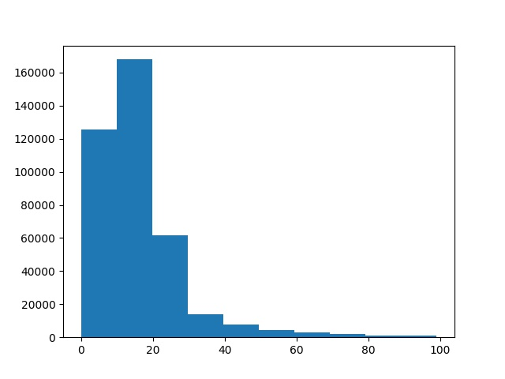
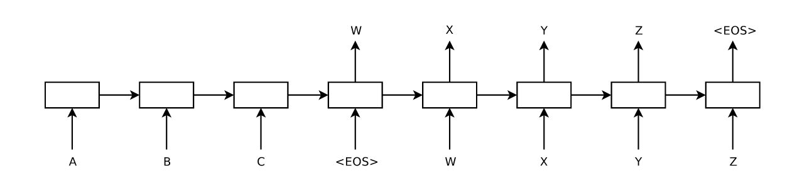
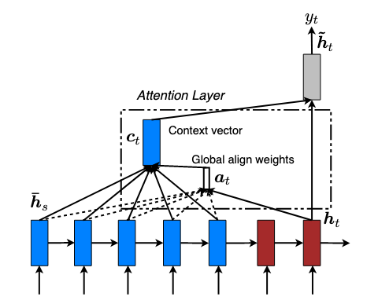
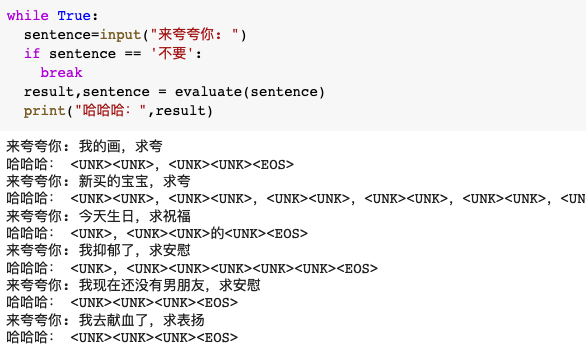
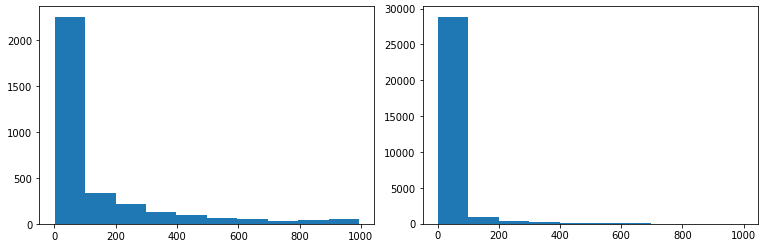
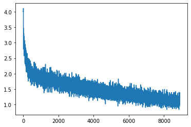
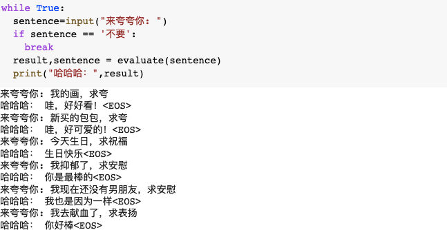

<h3 style="text-align:center;font-size:200%;" >让机器也学会夸夸</h3>

16307110216 何瑞安

### 一、选题动机

2019年3月，各类夸夸群在网络上流行起来，在夸夸群内，被人夸奖是家常便饭，有电商平台商家还推出了“夸人服务”，你只需要把人拉进群，便会开启一轮长达数分钟的吹捧，各种溢美之词都会源源不断的向你袭来。就算你只发送了一个标点符号，他们都能夸出花来。[1]

当我们遇到挫折或者踌躇不前的时候，其实特别需要这样的语言来安慰我们自己，而无论是虚假的也好，别扭的也罢。夸夸聊天语料变得非常丰富，获取信息的速度和能力得到极大提升的今天，我们自然可以从已经有的大量夸夸聊天语料学习并且建立一个夸夸聊天机器人程序，将这样的程序嵌入各种各样的软件和电子设备的话，人们每时每刻都可以及时获得鼓励，只要人们能够继续互相鼓励，收集更多语料，那么夸夸机器人也会更加精准。

### 二、数据获取

#### 1. 数据来源

现在已经有人爬取了豆瓣互相表扬组的数据，也就是夸夸语料，我们可以在GITHUB上找到这个语料。[2]但是这个语料未经清洗，存在各种字符，表情，无关回答；而且豆瓣中的聊天是主题导向的，更类似于讨论帖，每个人（包括发起者）都可以参与讨论，与我们的聊天有一定区别，这两个因素会影响到生成的质量。

第一个问题中的字符，表情可以通过UNICODE字符编码筛选来处理，中日韩统一表意文字（CJK Unified Ideographs）存在于UNICODE字符编码表的4E00–9FFF位置。[3]

第一个问题中的无关问答暂时没有进行人工筛选或者内容相关判断程序筛选，只是使用匹配去除含有”谢谢“的回复，这种回复一般是主题发起者的回帖，所以不是我们所希望的的匹配回答，对数据缺乏内容清洗可能会对生成的回答造成很大影响。

第二个问题主题导向的聊天可以将主题作为输入（问答系统中的问题），匹配相应的跟帖（问答系统中的回答），模拟聊天问答的语料进行编排。

#### 2. 数据分析

通过对字符编码筛选处理后的句子长度进行绘图，我们可以看到大部分的句子都集中在20字以内，而且我们的算法对处理短的定长数据效果比较好，所以我们需要对长度进行筛选，只取出问答句都只有20字的问答对。观察数据我们还可以知道，讨论里面掺杂了很多对他人的回复，最常见的就是发起者的”谢谢“，我们显然需要对这些干扰项进行排除。

经过定长限制（最大句子长度为20字），内容筛查（不能包含谢谢）的过滤之后最后使用的语料一共104592对，每一对中有一个被夸语句和夸夸语句（对应于问答系统中的问句和答句）。然后构建词表，并对不足长度的句子进行补全，后面补上<PAD>表示填充。

### 三、算法设计

#### 1. 算法概念

问答系统(Question Answering System, QA)是信息检索系统的一种高级形式。它能用准确、简洁的自然语言回答用户用自然语言提出的问题。其研究兴起的主要原因是人们对快速、准确地获取信息的需求。问答或者聊天系统可以采取规则，检索或者生成的模型，匹配模型在生产服务中已经广泛应用，而生成模型由于结果不稳定，应用受到了诸多限制。

生成模型对问题进行编码解析之后生成回答。我们这里采用的是基于神经网络的Seq2seq生成模型[4]，或者编码器-解码器（Encoder-Decoder）模型，它用到了两个循环神经网络，分别叫做编码器和解码器。编码器用来分析输入序列，解码器用来生成输出序列。

最基础的Seq2Seq模型包含了三个部分，即Encoder、Decoder以及连接两者的中间状态向量，Encoder通过学习输入，将其编码成一个固定大小的状态向量S，继而将S传给Decoder，Decoder再通过对状态向量S的学习来进行输出。

其中Encoder和Docoder，这里使用了GRU模块，循环神经网络（Recurrent Neural Network, RNN）的一种，每个时间步的隐藏状态只取决于该时间步及之前的输入子序列。和LSTM（Long-Short Term Memory）一样，也是为了解决长期记忆和反向传播中的梯度等问题而提出来的。相比LSTM，使用GRU能够达到相当的效果，并且相比之下更容易进行训练，能够很大程度上提高训练效率。

> 图片来源：Ilya Sutskever, Oriol Vinyals, and Quoc V. Le. 2014.Sequence to sequence learning with neural networks. NIPS.

注意力机制（Attention）[5]在自然语言处理中最初用来帮助解决机器翻译在句子过长时效果不佳的问题。这和人类的行为类似，事实上，在我们阅读句子的时候，也存在注意力机制。对于句子中某些重要的词，往往会抓住我们的注意力。然后在我们说话（句子生成）的时候也会回想，问题的中的某些关键点。

这种新的构架替输入句的每个文字都创造一个context vector，而非仅仅替输入句创造一个从最终的hidden  state得来的context vector，每个context vector能够被更有效的译码。而普通的Seq2seq模型其实就是每一个词的权重一样的注意力发散的模型。

> 图片来源： Luong, M. T. ,  Pham, H. , &  Manning, C. D. . (2015). Effective approaches to attention-based neural machine translation. *Computer Science*.

#### 2. 算法实现

本文的代码实现是基于TensorFlow Tutorial[6]进行修改实现的。假设输入是$x=(x_1,x_2,\dots,x_{Tx})$，输出是$y=(y_1,y_2,\dots,y_{t_y})$。

输入和输出都先需要进行编码，并进行词嵌入（Word Embedding）生成词向量。词向量是一种语言模型，它基于分布式假设，也就是出现在相同上下文（Context）下的词意思应该相近。我们可以用一个矩阵将索引表示的词序列转换成词向量表示的矩阵，这样在进行计算的时候能够学习到上下文关系。

编码器（Encoder)方面接受的是每一个单词词向量或者Word Embedding，和上一个时间点的隐藏状态Hidden State，输出的是这个时间点的隐藏状态Hidden State。
$$
h_s=GRU_{enc}(x_t,h_{t-1})
$$

接着我们使用Attention机制对编码器的结果和各个隐藏层进行处理，用最后的隐藏层与其他的隐藏层做一个Score，这里使用的是加性Attention。

$$
score(h_t,\overline{h}_s)=v_a^Ttanh(W_1h_t+W_2\overline{h}_s)
$$

然后用Softmax计算每一个Encoder的Hidden States对应的权重。
$$
\alpha_{ij} = \frac{exp(score(h_t,\overline{h}_s))}{\sum_{k=1}^{T_x}exp(score(h_t,\overline{h}_{s'}))}
$$
Context Vector是一个对于Encoder输出的Hidden States的一个加权平均。
$$
c_t = \sum_{j=1}^{T_x} \alpha_{ts}\overline{h}_s
$$

接着将解码器（Decoder）输入单词的Word Embedding和Context Vector的合并。

$$
\hat{y_{t-1}}=concat(y_{t-1},c_{t-1})
$$

Decoder方面接受的是目标句子里，加上上一个时间点的Hidden State。
$$
s_t = GRU_{dec}(\hat{y_{t-1}},s_{t-1})
$$

最后通过一个全连接层映射到词表空间，通过最大权重选择字符。优化器选择的是Adam，损失选择的是带掩码的交叉熵损失，也就是说只计算目标输出中存在的字符和现在输出的交叉熵，将填充的空白符不计算在内，然后求取均值作为该句回答的损失。

训练的时候使用的是Teacher Forcing算法[7]，使用上一时刻的输出作为下一时刻的输入。首先在每句话中添加一个字符去标识序列的开始，定义另一个字符去标识序列的结束，分别用<START>和<END>来表示。通过使用第$t$时刻的来自于训练集的期望输出作$y_t$为下一时刻的输入$x_{t+1}$，而不是直接使用网络的实际输出。

### 四、实验过程与结果

##### 1. 词表构建

本实验是在Google Colab上面运行的Jupyter Notebook程序，运行的系统是Linux 4.14，使用的GPU是Tesla T4，CUDA版本是10.1，Python版本3.6.9，TensorFlow版本是2.1.0-rc1。

在语料处理和构建词表的过程中，我们可以选择对中文文本进行分词处理或者直接使用汉字进行词表构建。一开始我是使用的分词处理（使用结巴分词库[8]），而且词表选择比较小，就导致了模型虽然虽然收敛，但是结果里全都是未登陆词<UNK>。

之后，我查阅了资料，看了一些论文，有研究显示相对于分词而言，按字编码有更好的效果。[9]他们在四个端到端的NLP任务中将此类基于单词的模型与基于字符的模型进行了比较，并尽可能地进行了一一比较。其中基于字符的模型始终优于基于单词的模型。 基于单词的模型的劣势归因于单词分布的稀疏性，这导致了更多的词汇外单词（OOV），过度拟合和缺乏域泛化能力。更严重的情况就会像我的实验一样全部收敛到未登陆词。

从文字本身的角度来分析，现在汉语不像古代汉语一样全部用字来表意，广泛造词，词汇有很大多变性，但是词汇的意思离不开使用的汉字，包含的相同汉字的词意思往往相近。相对于更小的部首而言，具有相同部首的字，由于汉字演化时间过长，在字词中很多已经丢失了原有的含义，所以字处于部首，字，词三者平衡的中间，能够达到比较好的编码和表意效果。

> 左图是语料中字的频率分布，右图是语料中词的频率分布

重新审视语料中的字词，我们可以看到网络聊天语料词汇复杂，表达多样，虽然从汉字上来看只有常用的3000左右汉字，但是词汇却高达近30000，而且使用频率也都非常低。由于Colab的算力和时间限制，如果使用更大的词表就会使得内存占用更大，模型的参数更多，训练时间更长，本实验无法使用很大的词表进行训练，所以转而使用了同等词表大小下表现更好的字来构建。

并且为了控制词表的大小，我们只取词表频率分布前2000个词进行编码，其他的词一律算作未登陆词。根据统计，前两千个词的使用频率都在28以上，其他词则小于这个阈值，作为10万级别的语料，这个阈值是合理的。

#### 2. 训练步骤

（1）下载豆瓣互相表扬组数据，并进行UNICODE过滤，定长限制，内容筛查等操作，将语料处理为分字的列表序列。

（2）然后我们构建词表，统计每一个字在全部选取语料中出现的频率，并且排序筛选出前2000个词加入词表，准备好字到索引，索引到字的两个映射。

（3）接着准备输入向量，我们使用TensorFlow自带的Dataset进行小批量（Batch）生成，将序列映射到词表索引空间编码，然后转换成张量Tensor并打乱，按需生成小批量的样本。

（4）然后构建模型，可以使用Keras的函数式API按照算法描述进行构建Encoder和Decoder。

（5）接着进行训练，对每个输入首先经过Encoder进行编码，然后应用Teacher Forcing算法每次输入一个生成的字符，根据输入预测下一个字符，然后每个Batch进行权重更新。

我们设置Batch大小为64，共有1634个Batch,训练6个EPOCH，训练损失变化情况如下图所示。

（6）最后对模型进行测试，同样也是让输入编码成向量，然后通过Encoder进行特征提取，Decoder根据特征按字一个个预测生成序列。

我们在输入若干可能的会话语句，虽然话题的覆盖并不完全，但是其中优秀的输出结果还是能够让人理解，没有很严重的语病，并且和主题能产生相关性。比如前两个我的画的回答是好好看，和新买的包包是好可爱，反应并不一样，而且还会加上语气词和符号；还有含有生日关键词的话，就会生成生日快乐。

### 五、结论与感想

#### 1. 实验结论

首先本实验训练了一个能够通过给定话题生成表扬语句的聊天机器人程序，能够进行简单地按主题回复，达到了表扬安慰的效果。说明通过神经网络等信息技术，将表扬赞赏等人类语言生成任务交给计算机是有可能的，这样的程序能够给人带来愉悦满足的情绪。

本实验提出了一个基于Seq2seq神经网络模型的训练方法，并给出了语料来源和使用软件，进行了对语料的提前处理，模型的构建，模型的训练等若干步骤，并探讨了其中遇到的问题，比如内容相关，算法选择和词表构建等。

#### 2. 不足与改进

其次这个实验存在很多的问题，第一，语料不够干净，噪音比较多，而且一般是多轮对话，上下文的关联性不强，加上网络用语的复杂性，使得训练效果不够好。

第二，使用的技术不够先进，许多研究和项目表明聊天机器人使用Transformer模型而不是GRU会带来更好的效果，结果中产生的词使用Beam Search能够改善Teacher Forcing很多缺点，使用更大数据集上面的预训练模型能够描述更好。

第三，对超参数调节不够细致，在这里每个网络层使用的几乎都是默认参数，很少进行调节，训练效果不够好。

#### 3. 实验感想

通过本次实验，我完整地体会了从数据获取，语料处理，模型构建，模型优化等一系列的自然语言处理的步骤，了解到其中需要的许多知识，和前人留下的宝贵经验，让我对课上的知识也有了更深的理解。

通过本次实验，我也学习到了如何使用神经网络工具进行自然语言处理，自学神经网络和机器学习相关知识虽然花费了很长时间，但是接触到了许多不一样的知识，也对接下来的学习有了更多的想法。

最后，我也特别希望之后能够学习到更多的知识来完善这个夸夸机器人，让机器能理解人类的语言，并且能够用话语给我们带来好心情，陪伴我们的生活。

### 六、参考资料

[1]夸夸群只是提供着虚幻的慰藉,徐汉雄,http://hb.people.com.cn/GB/n2/2019/0314/c194063-32738038.html

[2]豆瓣互相表扬组数据,XiaoPangxia,https://github.com/xiaopangxia/kuakua_corpus/blob/master/douban_kuakua_qa.txt

[3]The Unicode® Standard Chapter 18, Unicode  Consortium. ,https://www.unicode.org/versions/Unicode12.0.0/ch18.pdf

[4]Ilya Sutskever, Oriol Vinyals, and Quoc V. Le. 2014.Sequence to sequence learning with neural networks. NIPS.

[5]Bahdanau, D. ,  Cho, K. , &  Bengio, Y. . 2014. Neural machine translation by jointly learning to align and translate. *Computer Science*.

[6]Neural machine translation with attention,Tensorflow Team,https://www.tensorflow.org/tutorials/text/nmt_with_attention 

[7] Williams, R. J. , &  Zipser, D. . (1998). A learning algorithm for continually running fully recurrent neural networks. *Neural Computation, 1(2)*.

[8]结巴中文分词,Sun Junyihttps://github.com/fxsjy/jieba

[9]Li, X. ,  Meng, Y. ,  Sun, X. ,  Han, Q. ,  Yuan, A. , &  Li, J. .  (2019). Is word segmentation necessary for deep learning of chinese  representations?.
